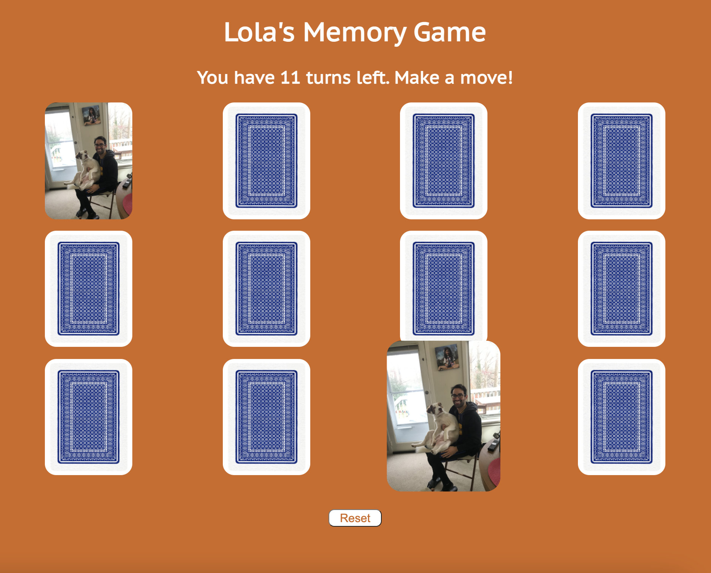

# Lola's Memory Game

A game that tests your memory about my dog's many poses.

Link to game: https://giorgiovh.github.io/memory-game/

Instructions: Click two cards at a time. If your clicked cards match, they disappear. Match all the cards in 10 turns or less or you lose!

Technologies used: HTML, CSS, and Javascript.

Next steps: Randomize the positioning of the cards and add different difficulty levels.

